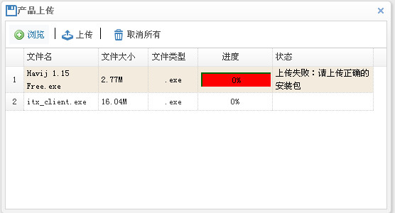

## **web平台开发文档**  
###更新记录（兼容上一版本） 10/17/2013 2:34:57 PM 
 
1. 增加window窗口iframe弹出方式，指定参数`iframe:true`   
2. 增加window窗口无按钮弹窗，指定参数`hasbutton:false` 
3. 修改删除和批量删除某些情况下报错的问题 
4. 删除和批量删除增加属性`grid`，解决多grid共存冲突问题 
5. 增加日期控件`easyui-my97`
6. 增加上传组件
7. 增加`hideCheckbox`和`disabledCheckbox`，可以设定datagrid中指定列隐藏或者禁用checkbox选择
###更新记录 8/26/2013 11:17:27 AM      
**前端组件更新：**  
1. 增加window窗口关闭接口：`$.window.close()`;  
2. 增加showDialog窗口关闭接口：`$.showDialog.close()`;   
3. 增加linkbtn属性hide，可以控制grid中某个button的显示和隐藏  
###更新记录     8/21/2013 2:57:02 PM   
**前端组件更新：**  
  1. `$.window(options)`接口增加form和returl参数 -[用法](#web6)  
  2. 增加`$.query()`查询接口  -[用法](#web8)  
  3. 重写删除和批量删除接口，合并为一个接口`$.deletes(options)`增加参数的扩展性 -[用法](#web7)  
  4. 修改form_submit接口，改为`$.form_submit(options)` ，增加参数returl和form -[用法](#web4)   
  5. 增加表格数据显示tips功能 -[用法](#web9) 

---
 
###**目录**  

* [前端基础组件的使用](#web)  
  * [资源文件的引入](#web1)  
  * [创建grid表格](#web2)  
  * [增加操作项toolbar](#web3)
  * [form表单](#web4)
  * [表单验证](#web5)
  * [弹框调用](#web6) 
  * [删除与批量删除](#web7)
  * [查询](#web8)
  * [其他接口(表格行特殊显示、高级查询)](#web9) 

---

<h3 id="web">前端基础组件的使用</h3>

**1. 资源文件的引入**   

资源文件由平台同意提供resources资源包，子系统在使用时将相应的资源文件引入即可。依赖的公用资源文件脚本如下： 
 
	<link rel="stylesheet" type="text/css" href="${base}/resources/css/main.css">
	<link rel="stylesheet" type="text/css" href="${base}/resources/css/icons.css">
	
	
	  

- `main.css` 主要样式文件，包含easyui样式定义，以及自定义样式  
- `icons.css` 图标样式文件  
- `jquery-1.7.2.min.js` jquery脚本文件  
- `jquery.easyui.min.js` easyui脚本文件  
- `jquery.easyui-ext.js` easyui自定义扩展文件  

> **tips:** 
>  
> - 以上脚本文件为公用的脚本文件，可以定义为一个layout宏（模板），避免了在每一个页面重复引用的麻烦，参考_common.html文件。  
> 在页面中我们可以直接通过引入宏来引入依赖的资源文件了。使用方式（以Freemarker为示例）：  
> `<#include "/plugins/common/_common.html"/>`    
>  `<@common>your content</@common>`   
> - 所有路径建议使用绝对路径方式，防止因为路径引发问题，如可在全局的config中配置new ContextPathHandler("base") 这样在页面中直接使用${base}/role/add方式引用即可。  

**2. 创建grid表格**  

grid表格为常用的展示数据信息表格，grid提供了方便易用的分页排序和拖动操作，开发者无需过多关心页面显示样式，把主要关注点放在数据渲染上。示例：
  
	<table id="dg" class="easyui-datagrid" title="角色列表"
		data-options="url:'${base}/role/data_render',toolbar:'#tb'">
		<thead>
			<tr>
				<th data-options="checkbox:true"></th>
				<th data-options="field:'name',width:80,sortable:true">
					角色名
				</th>
				<th data-options="field:'create_date',width:80,sortable:true">
					创建时间
				</th>
				<th data-options="field:'remark',width:100">
					备注
				</th>
				<th data-options="field:'id',align:'center',width:100,formatter:op">
					操作
				</th>
			</tr>
		</thead>
	</table>

以上是一个普通的table表格，需要我们定义好显示的头th（列名），在每个列中通过`field`指明对应的数据字段名称（和数据库字段名对应），如果想要支持easyui提供的效果，需要指明`class="easyui-datagrid"`(必须)，然后我们需要配置一个url，来请求后台的数据来对表格信息进行渲染，可以直接在table中使用`url="/role/data"` ,也可以在`data-options`中配置（如上）。这样一个数据表格就显示出来了。*更多api，参考easyui文档表格部分。*  

**3. 增加操作项toolbar**  

每个列表上经常会带有一些操作按钮以及查询条件，也就是toolbar，给列表添加一个toolbar也很简单，只需要在table上面定义一个div,如下：
  
	

		

			<a href="javascript:void(0)" onclick="add()" class="easyui-linkbutton"
				data-options="iconCls:'icon-plus',plain:true">添加角色</a> |
			<a href="javascript:void(0)" onclick="deletes()"
				class="easyui-linkbutton"
				data-options="iconCls:'icon-cancel',plain:true">批量删除</a> | 
			角色名：
			<input type="text" value="" id="name" class="input-text"
				onkeydown="query()" />
			<a href="javascript:void(0)" class="easyui-linkbutton" onclick="query()"
				data-options="iconCls:'icon-zoom'">查询</a>
		

	

在table中需要关联我们创建的toolbar, table中的data-options中添加`toolbar:'#tb'`。这样一个带有toolbar的表格就完成了。多行toolbar，可以定义多个div形式，如`

`。

**4. form表单**  

form表单为普通的表单格式，如下：  

	<form id="ff" class="form" method="post" action="${base}/account/save">
		

			<table class="table_form" width="100%">
				<tr>
					<td align="right">
						账号:
					</td>
					<td>
						<input class="easyui-validatebox span3" type="text"
							name="account.nam value="" />
					 </td>				
				</tr>
				<tr>
					<td></td>
					<td>
						<a href="javascript:void(0)" onclick="add()"
							class="easyui-linkbutton">保 存</a>
						<a href="javascript:void(0)" onclick="add_batch()"
							class="easyui-linkbutton">保存并继续</a>
						<a href="javascript:void(0)" onclick="reback()"
							class="easyui-linkbutton">取 消</a>
					</td>
				</tr>
			</table>
		

	</form>

需要指定`action`提交的url(也可以通过在form_submit(options)中指定`url:'${base}/account/save')`，提交方法默认使用`post` ,点击保存后调用方法`$.form_submit(options)`，returl为保存成功后转向的页面，如果没有指明该参数，保存后继续停留在当前页。  

接口： `$.form_submit(options)`  options为参数对象  

属性：  
扩展自easyui `$.fn.form.defaults`，除了可以使用easyui的form参数外（参考easyui 表单部分），还增加了自定义参数   
`returl`：提交完成后转向的页面  
`form`：指定需要提交的表单（为防止一个页面有多个form冲突），默认提交当前页所有form   

实例方法，保存和保存并继续两个方法调用如下：  

		function add(){
			$.form_submit({
				returl:"${base}/account",
				form:"#win" //指定只提交id为win的form表单
			});
		}
		function add_batch(){
			$.form_submit();//无参数
		}

**5. 表单验证**   

表单验证需要在输入框中添加`class="easyui-validatebox"`这样input就具备了验证功能，在输入框中指定对应的验证方法就能实现相应的验证功能了。比如非空验证：  

	<input class="easyui-validatebox" type="text"  data-options="required:true" value="" />
 

Easyui提供一些基础性的验证：
  
- required 必须输入验证 true|false  
- email 邮箱格式验证 true|false  
- url url地址合法性验证 true|false  
- length 输入长度验证，一个范围 length[1,10]
  
扩展：  

- remote 远程方法验证 remote[url,param,message]
- equalTo 两次输入一致性验证 equalTo[‘#password’] 此处为对应的选择器
- number 输入必须为数字
- safefilter 只允许汉字、英文字母、数字及下划线
- maxLength 最大长度不能超过 {0} 个字符 maxLength[10]
- minLength 最小长度不能少于 {0} 个字符 maxLength[1]
- words 只允许字母、数字及下划线
- pswfilter 密码必须同时包含大写字母、小写字母、数字、特殊字符（~、!、@、#、^、&、*、_、-、+、=）
- filter 过滤特殊字符验证（%`~@<>）  
- ip ip地址合法性验证  
- regx 正则表达式验证 regx[regx,message]  

验证也可以采用组合验证方式，一个复杂些的组合验证例子：  

	<input class="easyui-validatebox span3" type="text" name="role.name" 
	data-options="required:true,validType:['remote[\'${base}/role/has_role\',\'name\',\'角色名已存在\']','safefilter','length[1,20]']"
	value="${(role.name)!}" />

**6. 弹框调用**  

(1) 添加/编辑弹窗  

接口：`$.window(options)` options为属性对象  
属性：  
继承自easyui `$.fn.dialog.defaults`,相关属性可参考easyui的dialog部分，扩展属性：  
  
     `title`:弹窗显示名称  
	 `href`:表单地址  
	 `returl`:表单提交完成后返回的url，不指定默认返回当前父页面  
	 `form`:指定弹框中需要提交的表单  
	 `hasbutton` 默认弹框按钮是否显示（为true时不显示按钮）      
 		

使用方法：  

	function add(){
		$.window({
		title:"新建角色",
		href:"${base}/role/add"
		});
	} 

`$.window`接口会自动生成一个弹框，并且使用异步方式提交表单，返回相关处理信息。开发者无需关注提交动作，当然**需要在form表单中指定action=”your url”提交地址**，提交后返回一个{ret:"1",errcode:"1",msg:"添加用户失败"}json字符串格式，`$.window`根据json格式自动解析处理。 效果图：  
   

- 保存：关闭窗口，并且刷新列表页
- 保存并继续：保存数据后清空页面，继续填写。  

注：如果不想使用默认提供的按钮，可以通过传递属性`button`自定义显示按钮和操作，参照easyui dialog部分。

(2) 数据选择弹窗  
  
接口：`$.showDialog(options)` 用于处理需要选择公用页面数据的情况，支持单条记录和多条记录的选择。  
属性：  
`tilte`:弹窗显示名称  
`href`:公用页面地址  
`height`:弹框高度（非必需）  
`width`：弹框宽度(非必需)  
`handler`:回调函数  

使用方法：
  
	function select_user(){
		$.showDialog({
		title:"选择用户",
		height:400,
		width:600,
		href:"${base}/user/single",
		handler:function(data){//data为选择表格行的数据
				var textFiled = data.name;
				var idFiled = data.id;
				$("#user_name").val(textFiled);//赋值给对应文本框显示用
				$("#user_id").val(idFiled);//赋值给隐藏域保存使用
		}
		});
	}

效果图：  
   

注：**为避免冲突，提供公共页面api者，需指定公共页面table的id为`common-grid`** 

**7. 删除与批量删除**  

接口：`$.deletes(options)`  

属性： 
 
	 title : 提示框标题
	 info : 提示信息
	 href : 请求地址
	 params : 参数
	 returl : 删除后返回地址
	 handler:删除后回调方法  
	 grid:执行操作的表格（解决多表格下冲突，单个表格下无需指定）
使用方法：

	//批量删除
	function deletes(){
		$.deletes({
			href:"${base}/role/delete?ids=" //注：此处没有传递params，默认根据表格中的checkbox获取选择的数据
		});
	}
	//单个删除
	function deleteById(value){
		$.deletes({
			href:"${base}/role/delete",
			params:"id="+value //此处params也可不指定，直接附加到url后面
		});
	}

**8. 查询**  

接口：`$.query(options)`  
属性： `form` 定义的form表单名称 
使用方法：
  
	function query(){
		var param = $.query({
			form:'#search_form'
		});
		$("#dg").datagrid('load',param);
	}  
注：使用该方法需要把查询条件通过form表单包裹起来，参数值form指定的即为当前form表单的id。  

如果查询字段较少（1-2个），可以直接使用对应参数做查询，如：  

	function query(){
		$("#dg").datagrid('load',{
			name:$("#name").val()
		});
	}

**9. 其他接口**  

- 表格显示操作按钮，在实际使用中经常会用到在表格列中指定操作按钮的情形，针对这种情形，可以在定义表格列时，使用`formatter`接口。
	   
		<th data-options="field:'id',align:'center',width:100,formatter:op">
		操作
		</th>
formatter对应的为一个function(value,row)方法。value为当前行的id，row为行对象(参考easyui 表格部分)。比如在表格行我们添加上编辑和删除按钮，可以使用`linkbtn`接口。  
linkbtn接口属性：  
`value`:当前行id  
`option`:操作项，为一个对象数组，里面包含多个操作项的配置  
使用方法： 

		function op(value,row){
		return linkbtn(value,{
				option:[{
					text:'编辑', //操作显示文字
					icon:'icon-edit',//图标
					onclick:'edit' //点击调用的方法，对应着方法function edit(id){}
				},{
					text:'删除',
					icon:'icon-cancel',
					onclick:'deleteById'
				},{
					text:'权限分配',
					icon:'icon-calc',
					onclick:'perms_distri'
				}]
			});
		}

效果：  

- 高级查询  

接口：`$.queryMore(options)`  
属性：  
`href`:查询form页面  
`height`:高度  
`width`:宽度  
`handler`：回调函数，返回值data为查询条件   
使用方法：  

	function query_more(){
		$.queryMore({
			href:'${base}/plugins/host/_query.html',
			height:130,
			handler:function(data){		     
				 $("#dg").datagrid('load',data);//根据条件reload表格
			}
		});
	}
_query.html页面的input 需要指定`class="query"`否则无法获取查询条件   

- tips提示  

在表格显示时经常会遇到内容太多，无法全部显示的情况，此时可通过tips提示方式提供有好的预览。  
接口：  
`tooltip`  默认表格中超过10个字符的全部使用 ，可通过配置['字段名']来指定特殊字段使用  
使用方法：
  
	$(function(){
		$("#dg").datagrid({
			onLoadSuccess:function(){
				$(this).datagrid('tooltip',['log']);
			}
		});
	});

效果：  
  

- datagrid指定列checkbox的处理

接口：  
`hideCheckbox` 隐藏指定列的checkbox   
`disabledCheckbox`禁用指定列的checkbox  
用法：  

	$("#grid").datagrid('hideCheckbox',index);//index为行标 

效果：  

- 日期控件（new）  

该控件为扩展my97datapicker的控件，easyui默认日期控件体验不太友好。  
接口：`$("#id").my97()`  
属性：参考my97属性  
使用方法：  

	1.class注册： 				
	<input id="beg_date"  name="beg_date" type="text" class="easyui-my97" 
	data-options="dateFmt:'yyyy-MM-dd'"/>  

	2.js注册：  
	$('#dd').my97({});   

- 上传组件(new)  

上传组件依赖于第三方组件swfupload。因此在使用前需要引入相应的资源文件  

	
	
	  

属性：  

	url:上传后台地址  
	size:限定上传文件大小，默认200m  如：size:"200M"
	file_type：指定上传文件类型。如："*.exe;*.zip"  
	file_upload_limit：限定上传文件个数，默认50  
使用方法(结合easyui,统一样式)：  
	
		
	

		

			
			

				|<a href="javascript:void(0);" onclick="upload();"
					class="easyui-linkbutton"
					data-options="iconCls:'icon-up',plain:true">上传</a>
			

		

	

	<table id="datagrid" class="easyui-datagrid" data-options="autoRowHeight:true,nowrap:false">
		<thead>
			<tr>
				<th data-options="field:'name',width:60">
					文件名
				</th>
				<th data-options="field:'size',width:40">
					文件大小
				</th>
				<th data-options="field:'type',width:40,align:'center'">
					文件类型
				</th>
				<th data-options="field:'pro',width:60,align:'center'">
					进度
				</th>
				<th data-options="field:'state',width:80">
					状态
				</th>
			</tr>
		</thead>
	</table>
 
效果： 
 

**更多使用方法请参考easyui文档，本文档主要针对扩展方法做使用介绍**